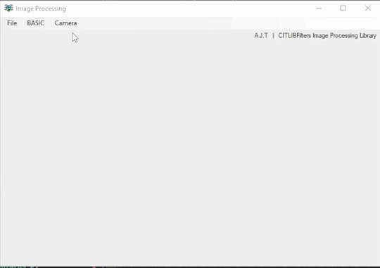

# Image Processing Simulation

This project is an image processing application developed in C# WinForms that implements convolution-based filters and image enhancement techniques. 

**Original Work:** This project uses the **CITLibFilters** library originally developed by **DR. CHRIS JORDAN ALIAC**.  

**Enhancements:** For this assignment, I, **ALYSSA JOYCE TAN**, have implemented and extended the following convolution-based image processing functions:  

### Features

- **Grayscale:**
- **Gamma**
- **Invert**  
- **Brightness**
- **Contrast**
- **Color Adjustment**

### Convolution Filters

- **Smooth**  
- **Gauss (Gaussian Blur)**  
- **Sharpen**  
- **MeanRemoval**  
- **Emboss**  

### Edge Detection Filters

- **HorzVertz**  
- **AllDirection**  
- **Lossy**  
- **HorizontalOnly**  
- **VerticalOnly**

## 

## Convolution Improvement

As part of the assignment, I've implemented additional edge detection filters to enhance the convolution capabilities:

- **EdgeDetectAll**  
- **EdgeDetectLossy**  
- **EdgeDetectHorzVertz (Horizontal + Vertical)**  